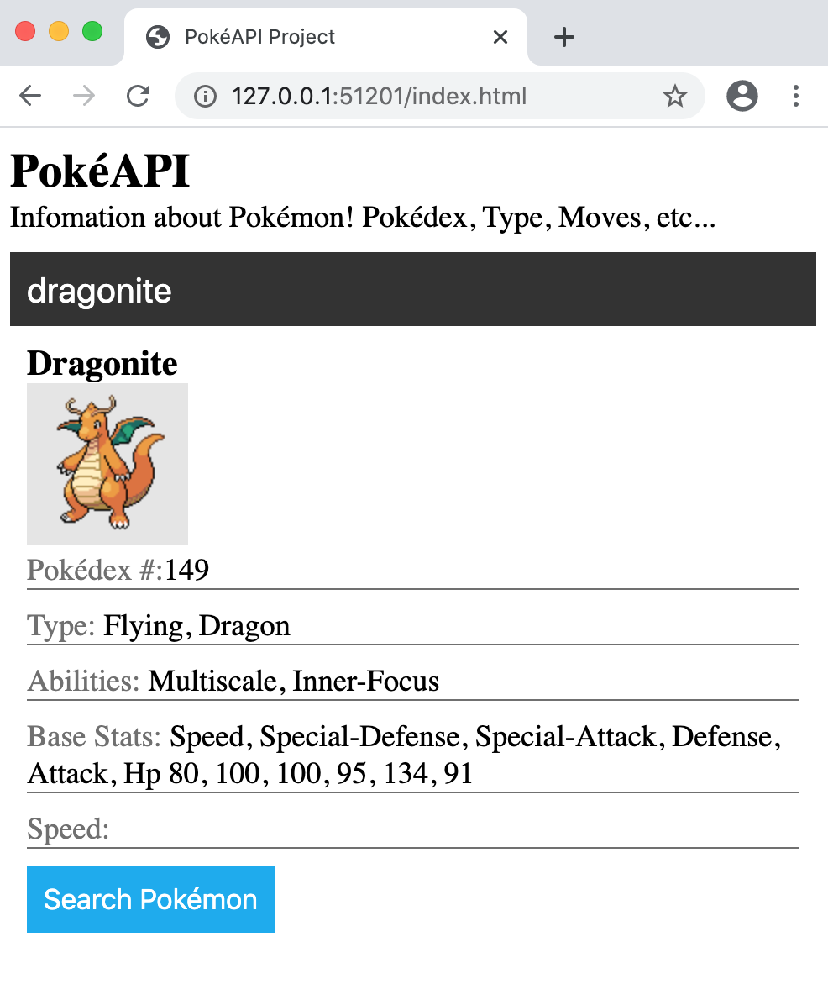
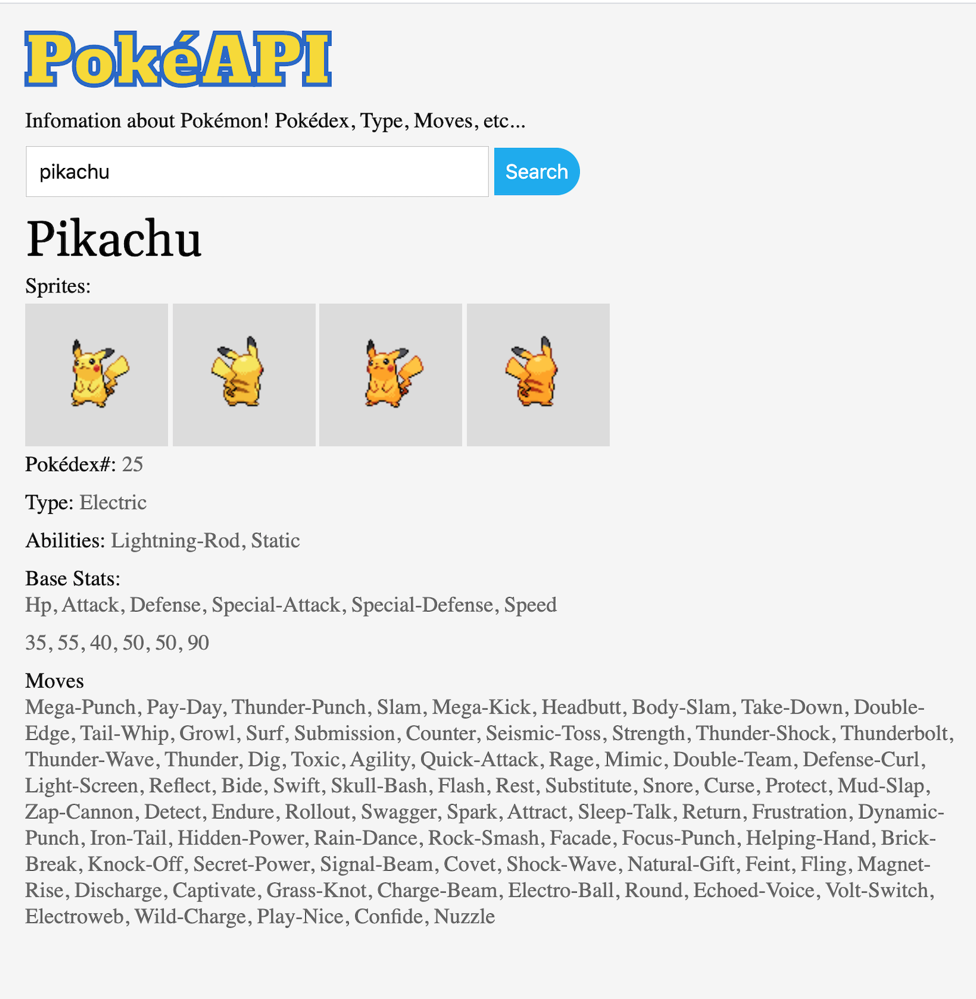
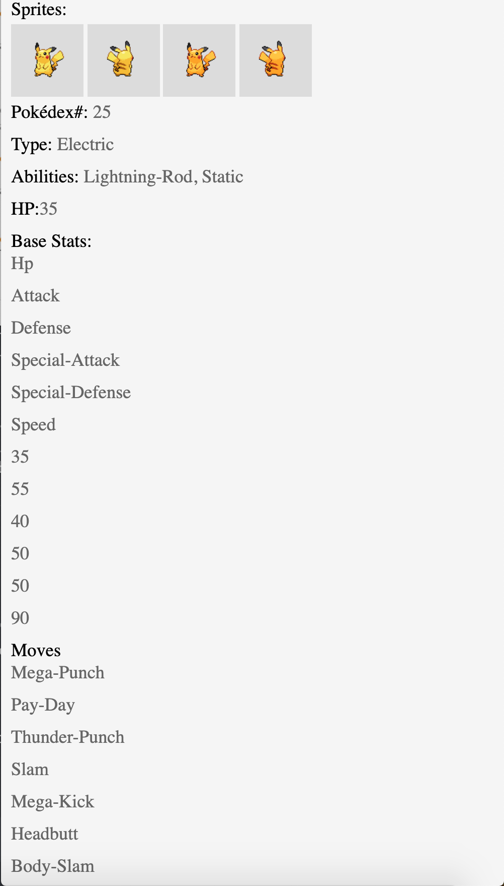

# AJAX Project: [PkéAPI](https://marklegit.github.io/AJAX-Project-PokeAPI/)

In this project I work with the [PokéAPI](https://pokeapi.co/) to request Pokémon data. The PokéAPI is built around the Pokémon video games. I have prior knowledge of Pokémon and this helped me understand and layout the content better. I added small details that will improve the user experience for Pokémon fans.

## Concept
The way many Pokémon fans search for Pokémon information (including me) is one at a time. This way saves time since there are more than 800 Pokémon. Because of that I decided to make my application based around typing the name of the Pokémon **YOU** want to learn more about. I understand that this is not a good user experience for newcomers. 

### How to use
Type the Pokémon name and click the search `button` or `enter`.

Some of my favorite Pokémon:
1. Venusaur
2. Machamp
3. Rhyperior
4. Dragonite
5. Tyranitar
6. Electivire
7. Terrakion

## Design
### Overall
When building this application an important factor was to have a clean layout that was appealing and that displayed as much data as possible at a glance.

### Mobile
A part of my project was to add a Hamburger Menu and indeed my website is responsive. I used `classList.toggle()` to make this work. The layout is a bit different for mobile.

```
const toggleBtn = document.querySelector(".lines-container");
let line1 = document.querySelector(".line1")
let line2 = document.querySelector(".line2")
let line3 = document.querySelector(".line3")
//On click adds class for the Hamburger Menu to display | animation for 3 lines
function toggleMenu(){
 const navbarToggle = document.getElementById("main-navbar");
	navbarToggle.classList.toggle("menu-active");
	line1.classList.toggle("active");
	line2.classList.toggle("active");
	line3.classList.toggle("active");
}
toggleBtn.addEventListener("click", toggleMenu);

```

## What To Expect
Upon seaching a Pokémon name you will get the **Pokémon's**:

1. Name
2. Artwork (if available)
3. National Pokédex
4. Region
5. Type
6. Abilities
7. Base Stats
 * Hp
 * Attack
 * Defense
 * Special Attack
 * Special Defense
 * Speed
8. Total Base Stats
9. Label of Pseudo-Legendary or Legendary if applicable
10. Sprites (if available)
 * Front sprite
 * Front sprite Shiny
 * Back sprite
 * Back sprite Shiny
11. Moves
 * **Move**: Move name
 * **Method**: Method of learning the move
 * **Level**: The level required to learn the move
 * **Game Version**: The game version in which this move can be obtained

## Challeges
#### JavaScript
I use AJAX for this Project.

I have a `pokemon` object that stores the data I need for a Pokémon. Each one is a property of the object.
```
//Pokémon Object
const pokemon = {};
```
I have many properties for the `pokemon` object, which then gets inserted into the HTML using `innerHTML` when the user searches.
```
//Pokemon properties | variables attached to the pokemon object 
pokemon['name'] = data.name;
pokemon['spriteFront'] = data.sprites['front_default'];
pokemon['spriteBack'] = data.sprites['back_default'];
pokemon['shinySpriteFront'] = data.sprites['front_shiny'];
pokemon['shinySpriteBack'] = data.sprites['back_shiny'];
pokemon['pokedex'] = data.id;
```
How I add the object properties using InnerHTML code:
```
//Adds the data to HTML using InnerHTML or src if it's an image
document.getElementById("pokemon-name").innerHTML = pokemon.name;
document.getElementById("pokemon-artwork").src = artWorkUrl;
document.getElementById("pokemon-front-sprite").src = pokemon.spriteFront;
document.getElementById("pokemon-back-sprite").src = pokemon.spriteBack;
document.getElementById("pokemon-front-sprite-shiny").src = pokemon.shinySpriteFront;
document.getElementById("pokemon-back-sprite-shiny").src = pokemon.shinySpriteBack;
document.getElementById("pokedex-id").innerHTML = pokemon.pokedex;
```
The PokéAPI is very detailed and it's very complex to access. At first, I had a difficult time getting the base stats individually.



Using `map()` I finally got the base stats, but they are next to each other. I learned that the stats are in reverse order when compared to the Pokémon videos games and because of that I had to use `reverse()` at first. Using `<br>` made the data look more organized.



After some research I got each base stat individually shown below.



The JavaScript code below is for each individual base stat:
```
//Pokemon base stats
pokemon["baseHp"] = data.stats[5].base_stat;
pokemon["baseAttack"] = data.stats[4].base_stat;
pokemon["baseDefense"] = data.stats[3].base_stat;
pokemon["baseSpecialAttack"] = data.stats[2].base_stat;
pokemon["baseSpecialDefense"] = data.stats[1].base_stat;
pokemon["baseSpeed"] = data.stats[0].base_stat;
```
 I set a property to the `pokemon` object. For example:
```
pokemon['baseHP'] = data.stats[5].base_stats
```
Below is how i used `map()` to get data for the moves/game version table section. I am using a template literal to add `<li></li>` and `<br>` to move each data into a new line. The `li` goes inside my `ol` for styling reasons.
```
//Table row 4: displays the game version that the move belongs to
pokemon['gameVersion'] = data.moves.map(function(gameVersionMove, idx, pokemon){
return `<li>${gameVersionMove.version_group_details.map(versionGame => `<br>${versionGame.version_group.name}`).join("")}</li>`}).join("");
```

#### CSS
Styling the **Moves** section was very difficult because I was using ```map()``` to get all my data. It was my first time using `map` and later I would learn that template literals would be my solution to having each data as a column.

Pokémon: Ditto

|Move/s| Method | Level| Game Version| 
|----| ---- | --- | --- |
|Transform| level-up | 1 |ultra-sun-ultra-moon|

## For Pokémon Fans
### Pseudo Legendary and Legendary
As an extra touch, I label certain Pokémon based on their total base stats. 

**Pseudo-Legendary** is a term used on a Pokémon with a Total Base Stats of exactly 600. A few Pseudo-Legendary below:

* Dragonite
* Tyranitar
* Salamence
* Metagross
* Garchomp


**Legendary** is the strongest Pokémon tier, they have highest Total Base Stats. Their Total Base Stats has to be greater or equal to 601. They are often banned in the video game tournaments. A few legendary Pokémon below:

* Mewtwo
* Ho-oh
* Lugia
* Kyogre
* Groudon
* Rayquaza


I label them with an `if else` conditional statement.

```
//Checks for the total base stat and labels them Pseudo-Legendary or Legendary
let pokemonBaseLabel = document.querySelector(".pokemon-base-label")
if (sumOfBaseStats == "600"){
	pokemonBaseLabel.innerHTML = "Pseudo-Legendary";
	pokemonBaseLabel.style.color = "black";
	pokemonBaseLabel.style.backgroundColor = "rgb(0, 0, 0, 0.1)";
	pokemonBaseLabel.style.border = "1px solid #aaa";
} else if (sumOfBaseStats >= "601"){
	pokemonBaseLabel.innerHTML = "Legendary";
	pokemonBaseLabel.style.color = "white";
	pokemonBaseLabel.style.backgroundColor = "rgb(0, 0, 0, 0.6)";
	pokemonBaseLabel.style.border = "1px solid #aaa";
} else {
	pokemonBaseLabel.innerHTML = "";
	pokemonBaseLabel.style.color = "";
	pokemonBaseLabel.style.backgroundColor = "";
	pokemonBaseLabel.style.border = "";
}
```
### Base stat Label
Next to a Pokémon you can see a word. I label their base stats Low, Average, High, and Extreme. This helps point out if a stat is weak or strong. Here's the condition I added on each stat as an indicator.
```
//HP label
if (pokemon.baseHp <= "60"){
	hpGauge.style.backgroundColor = "#f52727";
	hpGauge.innerHTML = "Low";
} else if (pokemon.baseHp >= "61" && pokemon.baseHp < "90" ){
	hpGauge.style.backgroundColor = "#edcd40"
	hpGauge.innerHTML = "Average";
} else if (pokemon.baseHp >= "90" && pokemon.baseHp < "120"){
	hpGauge.style.backgroundColor = "#08c486";
	hpGauge.innerHTML = "High";
} else if(pokemon.baseHp >= "120"){
	hpGauge.style.backgroundColor = "#74a1a3";
	hpGauge.innerHTML = "Extreme";
} else{
	hpGauge.style.display = "none";
	hpGauge.innerHTML = "";
}
 ```
 
 ### Region
 This is the easiest way categorize each Pokémon from different region using their Pokédex Number.
 ```
//Checks for the Pokédex number to label a pokemon's region | generation
let pokemonRegion = document.getElementById("pokemon-region");
	if (pokemon.pokedex >= 1 && pokemon.pokedex <= 151){
			pokemonRegion.innerHTML = "Kanto | Generation I";
		} else if (pokemon.pokedex >= 152 && pokemon.pokedex <= 251){
			pokemonRegion.innerHTML = "Johto | Generation II";
		} else if (pokemon.pokedex >= 252 && pokemon.pokedex <= 386){
			pokemonRegion.innerHTML = "Hoenn | Generation III";
		} else if (pokemon.pokedex >= 387 && pokemon.pokedex <= 493){
			pokemonRegion.innerHTML = "Sinnoh | Generation IV";
		} else if (pokemon.pokedex >= 494 && pokemon.pokedex <= 649){
			pokemonRegion.innerHTML = "Unova | Generation V";
		} else if (pokemon.pokedex >= 650 && pokemon.pokedex <= 721){
			pokemonRegion.innerHTML = "Kalos | Generation VI";
		} else if (pokemon.pokedex >= 722 && pokemon.pokedex <= 808){
			pokemonRegion.innerHTML = "Alola | Generation VII";
		}
 ```
 ## Summary
 
 I enjoyed working on this Project and learning about API as well as the `map()` and while the API is missing some data it's very fun to use for practice.
 
 ---
 
#### @ 2020 Mark Gutiérrez
